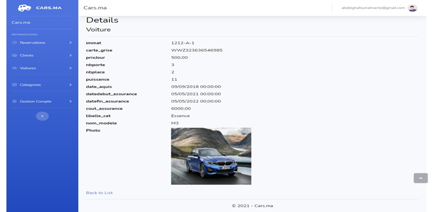
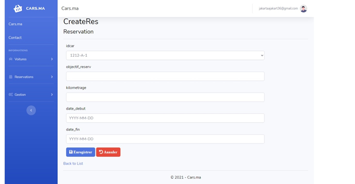

# Car-Rental
A full stack web application built with .Net MVC and MS SQL server dedicated for car rental companies:
----------

----------

## App Features :

#### Admin :

- Login  
- Manage Cars models and brands  
- Manage Contracts and Reservations  
- Print informations on pdf on csv files  
- Manage Clients  
#### Client :
- Create account  
- Login  
- Chose Cars and view details  
- Create reservations  
- Manage Contracts  

## App Screenshots :

#### Admin View :

- Login :  
 
- Manage cars (CRUD)  :  
 
- Add cars :  
 
- Check car details :  
 
- Manage users/Clients :  
 
- Manage contracts :  
 
- Manage models and brands :  
 
 
- Manage reservations (grant/suspend/revoke) :  
 
- Reservation details:  
 

#### Client View :

- Register :
 
- View available cars with details :
 
- Manage reservations :
 
 
 
- Manage personal infos/account :
 
 
- Contact Page :
 
